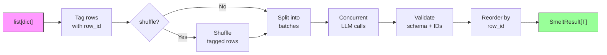
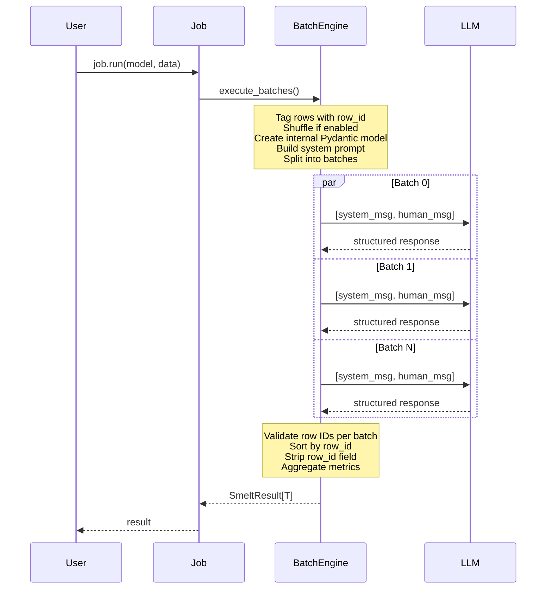
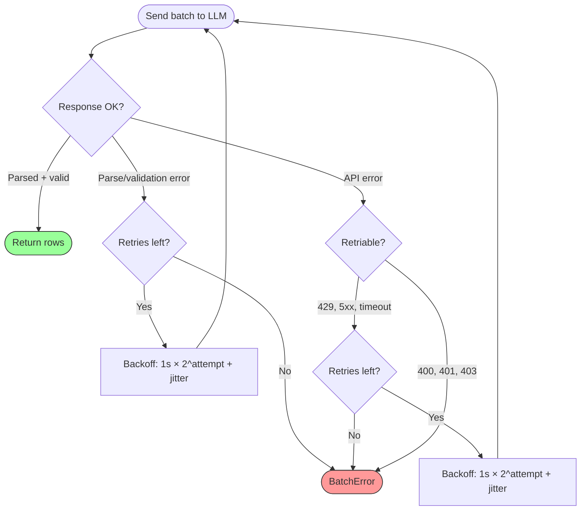
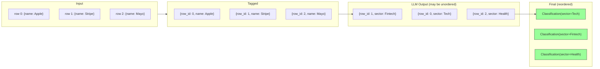
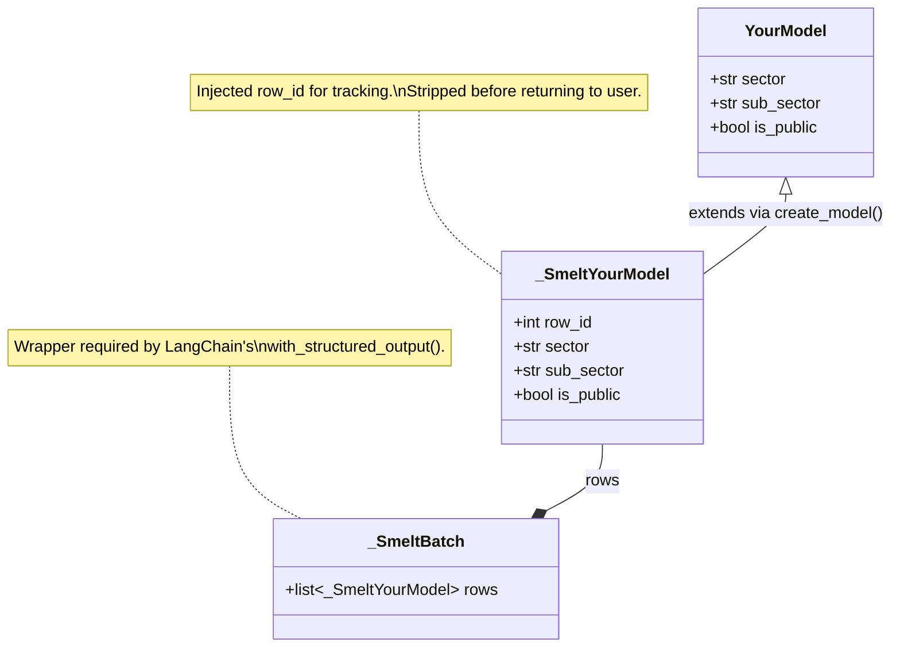

# Smelt

LLM-powered structured data transformation. Feed in rows of data, get back strictly typed Pydantic models — batched, concurrent, and validated.

```python
from smelt import Model, Job
from pydantic import BaseModel

class Classification(BaseModel):
    sector: str
    sub_sector: str
    is_public: bool

model = Model(provider="openai", name="gpt-4.1-mini")
job = Job(
    prompt="Classify each company by industry sector and whether it's publicly traded.",
    output_model=Classification,
    batch_size=20,
    concurrency=3,
)

result = job.run(model, data=[
    {"name": "Apple", "desc": "Consumer electronics and software"},
    {"name": "Stripe", "desc": "Payment processing platform"},
    {"name": "Mayo Clinic", "desc": "Nonprofit medical center"},
])

for row in result.data:
    print(row)  # Classification(sector='Technology', sub_sector='Consumer Electronics', is_public=True)
```

## Install

```bash
pip install smelt[openai]      # OpenAI models
pip install smelt[anthropic]   # Anthropic models
pip install smelt[google]      # Google Gemini models
```

Requires Python 3.10+.

---

## Architecture

### Pipeline Overview



### How a Job Executes



### Retry & Backoff Flow

Each batch independently retries on failure. Validation errors (bad schema) and transient API errors (429, 5xx) trigger retries. Client errors (400, 401, 403) fail immediately.



### Concurrency Model

Smelt uses `asyncio.Semaphore` for cooperative async concurrency — no threads, no process pools. While one batch awaits an LLM response, others can fire off their requests on the same thread.

```mermaid
gantt
    title concurrency=3, batch_size=5, 15 rows
    dateFormat X
    axisFormat %s

    section Batch 0
    LLM call (rows 0-4)   :active, b0, 0, 3

    section Batch 1
    LLM call (rows 5-9)   :active, b1, 0, 4

    section Batch 2
    LLM call (rows 10-14) :active, b2, 0, 2

    section Semaphore
    3 slots occupied       :crit, s0, 0, 2
    2 slots occupied       :s1, 2, 3
    1 slot occupied        :s2, 3, 4
```



### Row ID Tracking

Smelt injects a `row_id` field into your model, tells the LLM to echo it back, then validates and strips it. This ensures correct ordering even when batches complete out of order.



### Dynamic Model Creation

Under the hood, smelt dynamically extends your Pydantic model to add `row_id`, then wraps it in a batch container for `with_structured_output`.



### Error Handling Modes

```mermaid
flowchart TD
    subgraph "stop_on_exhaustion = True (default)"
        A1[Batch fails] --> A2[Set cancel event]
        A2 --> A3[Pending batches skip]
        A3 --> A4[Raise SmeltExhaustionError]
        A4 --> A5["e.partial_result has\nsuccessful batches"]
    end

    subgraph "stop_on_exhaustion = False"
        B1[Batch fails] --> B2[Record BatchError]
        B2 --> B3[Continue processing]
        B3 --> B4[Return SmeltResult]
        B4 --> B5["result.errors has failures\nresult.data has successes"]
    end

    style A4 fill:#f99,stroke:#333
    style B4 fill:#ff9,stroke:#333
```



---

## API

### `Model`

Wraps a LangChain chat model provider. Uses `init_chat_model` under the hood, so any LangChain-supported provider works.

```python
model = Model(
    provider="openai",          # LangChain provider name
    name="gpt-4.1-mini",       # Model identifier
    api_key="sk-...",           # Optional — falls back to env var (e.g. OPENAI_API_KEY)
    params={"temperature": 0},  # Forwarded to the chat model constructor
)
```

### `Job`

Defines what transformation to run and how to batch it.

```python
job = Job(
    prompt="Your transformation instructions here",
    output_model=MyPydanticModel,  # Schema for each output row
    batch_size=10,                 # Rows per LLM request (default: 10)
    concurrency=3,                 # Max concurrent requests (default: 3)
    max_retries=3,                 # Retries per failed batch (default: 3)
    shuffle=False,                 # Shuffle rows before batching (default: False)
    stop_on_exhaustion=True,       # Raise on failure vs collect errors (default: True)
)
```

Run synchronously or asynchronously:

```python
# Sync — use in scripts
result = job.run(model, data=rows)

# Async — use in notebooks, async apps
result = await job.arun(model, data=rows)
```

> **Note:** `job.run()` cannot be called from within an async event loop (e.g. Jupyter). Use `await job.arun()` in those contexts.

### `SmeltResult[T]`

```python
result.data       # list[T] — transformed rows in original order
result.errors     # list[BatchError] — failed batches
result.metrics    # SmeltMetrics — tokens, timing, retries
result.success    # bool — True if no errors
```

### `SmeltMetrics`

```python
result.metrics.total_rows         # Total input rows
result.metrics.successful_rows    # Rows with valid output
result.metrics.failed_rows        # Rows in failed batches
result.metrics.total_retries      # Cumulative retries across all batches
result.metrics.input_tokens       # Total input tokens consumed
result.metrics.output_tokens      # Total output tokens consumed
result.metrics.wall_time_seconds  # Wall-clock duration
```

---

## Error Handling

All exceptions inherit from `SmeltError`.

| Exception | When |
|---|---|
| `SmeltConfigError` | Invalid config (bad provider, empty prompt, etc.) |
| `SmeltValidationError` | LLM output fails schema validation |
| `SmeltAPIError` | Non-retriable API error (401, 403) |
| `SmeltExhaustionError` | Batch exhausted all retries (`stop_on_exhaustion=True`) |

`SmeltExhaustionError` carries a `partial_result` with any successfully processed batches:

```python
from smelt.errors import SmeltExhaustionError

try:
    result = job.run(model, data=rows)
except SmeltExhaustionError as e:
    print(f"Partial: {len(e.partial_result.data)} rows succeeded")
    print(f"Failed: {len(e.partial_result.errors)} batches")
```

Set `stop_on_exhaustion=False` to collect errors without raising:

```python
job = Job(prompt="...", output_model=MyModel, stop_on_exhaustion=False)
result = job.run(model, data=rows)

if not result.success:
    for err in result.errors:
        print(f"Batch {err.batch_index} failed: {err.message}")
```

---

## Supported Providers

Any provider supported by LangChain's `init_chat_model`. Tested with:

| Provider | `provider` value | Example models |
|---|---|---|
| OpenAI | `"openai"` | `gpt-4.1-mini`, `gpt-4.1`, `gpt-4o`, `o4-mini` |
| Anthropic | `"anthropic"` | `claude-sonnet-4-20250514`, `claude-haiku-4-5-20251001` |
| Google Gemini | `"google_genai"` | `gemini-2.5-flash`, `gemini-2.5-pro`, `gemini-2.0-flash` |

---

## Project Structure

```
src/smelt/
├── __init__.py        # Public API exports
├── model.py           # Model — LLM provider config
├── job.py             # Job — transformation definition + run/arun
├── batch.py           # Async batch engine, retry, concurrency
├── prompt.py          # System/human message construction
├── validation.py      # Dynamic Pydantic model creation, row ID validation
├── types.py           # SmeltResult, SmeltMetrics, BatchError
└── errors.py          # Exception hierarchy
```

---

## Development

```bash
git clone https://github.com/Cydra-Tech/smelt.git
cd smelt
uv sync --all-extras

# Unit tests (mocked, no API keys needed)
uv run pytest tests/ --ignore=tests/test_live.py

# Live API tests (requires .env with API keys)
uv run pytest tests/test_live.py -v

# Lint
uv run ruff check src/ tests/
```

## License

MIT
