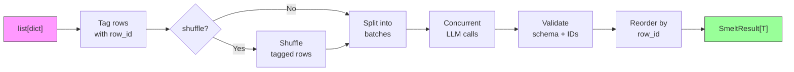
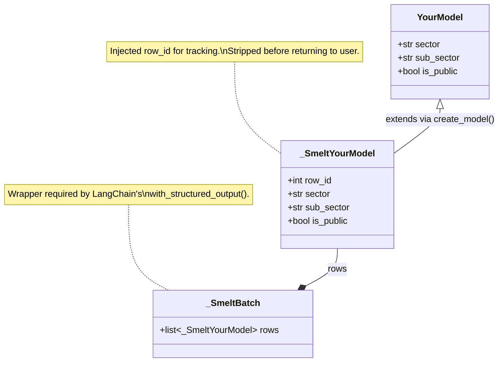
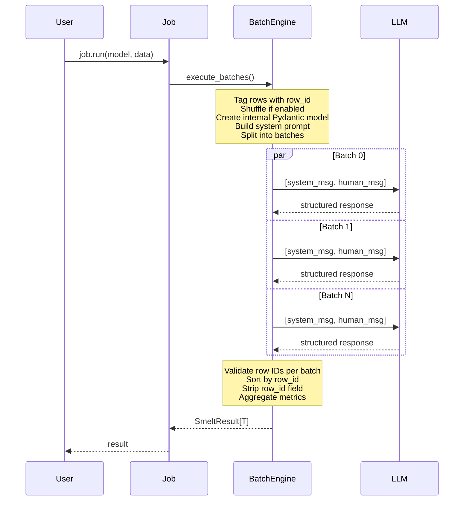
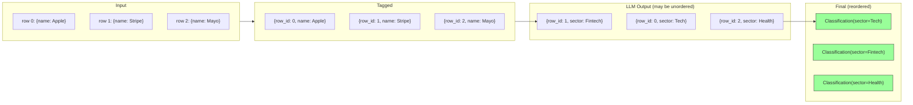

# Architecture

This page explains how smelt works under the hood — from receiving your data to returning typed results.

## Pipeline overview



Every `job.run()` call goes through these steps:

1. **Tag** — Each input dict gets a `row_id` (0, 1, 2, ...) for tracking
2. **Shuffle** — If `shuffle=True`, randomize row order before batching
3. **Split** — Divide tagged rows into chunks of `batch_size`
4. **Execute** — Send batches concurrently to the LLM via `asyncio.Semaphore`
5. **Validate** — Check each batch response: correct row count, matching IDs, valid schema
6. **Reorder** — Sort all successful rows back into original input order by `row_id`
7. **Return** — Package into `SmeltResult[T]` with data, errors, and metrics

## Step-by-step walkthrough

### Step 1: Row tagging

Your input `list[dict]` is converted to internal `_TaggedRow` objects:

```python
# Your input:
data = [
    {"name": "Apple", "desc": "Tech company"},
    {"name": "Stripe", "desc": "Payments"},
]

# Internally becomes:
tagged = [
    _TaggedRow(row_id=0, data={"name": "Apple", "desc": "Tech company"}),
    _TaggedRow(row_id=1, data={"name": "Stripe", "desc": "Payments"}),
]
```

The `row_id` is the row's position in your original list. This is how smelt guarantees results come back in the same order you sent them, even when batches complete out of order.

### Step 2: Dynamic model creation

Smelt extends your Pydantic model to add `row_id`, then wraps it for structured output:

```python
# Your model:
class Classification(BaseModel):
    sector: str
    is_public: bool

# Smelt creates internally:
class _SmeltClassification(Classification):
    row_id: int      # Injected for tracking

class _SmeltBatch(BaseModel):
    rows: list[_SmeltClassification]   # Wrapper for structured output
```

This is done dynamically via Pydantic's `create_model()`, so it works with any user model including those with custom validators.



!!! info "Why a batch wrapper?"
    LangChain's `with_structured_output()` requires a single Pydantic model, not a `list[Model]`. The `_SmeltBatch` wrapper with a `rows` field provides this. The LLM returns a JSON object with `{"rows": [...]}`, which LangChain parses into the wrapper model.

!!! warning "Reserved field name"
    Your output model **cannot** have a field named `row_id` — smelt reserves it for internal tracking. If your model has a `row_id` field, smelt will raise `SmeltConfigError` at job creation time.

### Step 3: Prompt construction

Smelt builds two messages for each batch:

**System message** (shared across all batches):
```
You are a structured data transformation assistant.

## Task
{your prompt here}

## Rules
- You will receive a JSON array of objects. Each object has a "row_id" field.
- For EACH input object, produce exactly one output object.
- Every output object MUST include the same "row_id" as the corresponding input object.
- Do NOT skip, merge, duplicate, or reorder rows.
- Return ALL rows — the count of output rows must equal the count of input rows.

## Output Schema
Each output row must conform to this schema:
- row_id (int, required)
- sector (str, required) — Primary industry sector
- sub_sector (str, required) — More specific sub-sector
- is_public (bool, required) — Whether the company is publicly traded

Return your response as a JSON object with a single "rows" key containing the array of output objects.
```

**Human message** (unique per batch):
```json
[
  {"row_id": 0, "name": "Apple", "desc": "Tech company"},
  {"row_id": 1, "name": "Stripe", "desc": "Payments"}
]
```

!!! tip "Better prompts = better results"
    The system prompt includes your `prompt` string verbatim. Be specific about what you want. For example, instead of "classify companies", say "classify each company by its primary GICS industry sector and sub-sector. Determine if the company is publicly traded on a major stock exchange."

### Step 4: Concurrent execution

Batches run concurrently using `asyncio.Semaphore(concurrency)`:



Each batch independently:

1. Acquires a semaphore slot
2. Calls `structured_model.ainvoke([system_msg, human_msg])`
3. Gets back `{raw: AIMessage, parsed: _SmeltBatch, parsing_error: None}`
4. Extracts token usage from `raw.usage_metadata`
5. Validates the parsed response (row IDs, count)
6. On failure: retries with exponential backoff
7. Releases the semaphore slot

### Step 5: Response validation

For each batch response, smelt validates four invariants:

| Check | What it catches |
|---|---|
| **Row count** | LLM returned 3 rows but batch had 5 — it skipped rows |
| **No duplicates** | LLM returned `row_id: 2` twice — it duplicated a row |
| **No missing IDs** | LLM returned `row_id: 0, 2` but not `1` — it skipped a row |
| **No unexpected IDs** | LLM returned `row_id: 99` which wasn't in the batch — it hallucinated |

If any check fails, smelt raises `SmeltValidationError` internally and retries the entire batch.

### Step 6: Row ID tracking and reordering



After all batches complete:

1. Collect all validated rows from all successful batches
2. Sort by `row_id` (ascending)
3. Call `strip_row_id()` on each — does `model_dump(exclude={"row_id"})` then `model_validate()` back to your original type
4. The result is `list[YourModel]` in exact original input order

### Step 7: Result assembly

All metrics are aggregated across batches:

```python
SmeltResult(
    data=[...],          # Ordered list of your Pydantic models
    errors=[...],        # BatchError for each failed batch
    metrics=SmeltMetrics(
        total_rows=100,
        successful_rows=95,
        failed_rows=5,
        total_batches=10,
        successful_batches=9,
        failed_batches=1,
        total_retries=3,
        input_tokens=15000,
        output_tokens=8000,
        wall_time_seconds=4.521,
    ),
)
```

## Module structure

```
src/smelt/
├── __init__.py        # Public API: Model, Job, SmeltResult, errors
├── model.py           # Model — wraps LangChain's init_chat_model
├── job.py             # Job — defines transformation + run/arun/test/atest
├── batch.py           # Async batch engine: concurrency, retry, orchestration
├── prompt.py          # System/human message construction
├── validation.py      # Dynamic Pydantic model creation, row ID validation
├── types.py           # SmeltResult, SmeltMetrics, BatchError, internal types
└── errors.py          # SmeltError hierarchy
```

| Module | Responsibility |
|---|---|
| `model.py` | Thin wrapper around `init_chat_model`. Lazy initialization + caching. |
| `job.py` | User-facing entry point. Validates config, delegates to `batch.py`. |
| `batch.py` | Core engine. Orchestrates the full pipeline: tag → split → concurrent execute → validate → reorder → assemble. |
| `prompt.py` | Builds the system message (prompt + rules + schema) and human message (JSON data). |
| `validation.py` | Creates internal Pydantic models with `row_id`, validates batch responses, strips `row_id` from results. |
| `types.py` | Data containers: `SmeltResult`, `SmeltMetrics`, `BatchError`, and internal `_TaggedRow` / `_BatchResult`. |
| `errors.py` | Exception hierarchy: `SmeltError` → `SmeltConfigError`, `SmeltValidationError`, `SmeltAPIError`, `SmeltExhaustionError`. |

## Key design decisions

| Decision | Choice | Rationale |
|---|---|---|
| Structured output | LangChain `with_structured_output(include_raw=True)` | Gets parsed model + raw message for tokens + non-throwing parse errors |
| Row tracking | `row_id` field injected via `create_model(__base__=user_model)` | Inherits all user validators, clean separation |
| Batch wrapper | Dynamic `_SmeltBatch` model with `rows: list[InternalModel]` | Required because `with_structured_output` needs a single model, not a list |
| Concurrency | `asyncio.Semaphore` | Standard, predictable, no worker pool overhead |
| Cancellation | Cooperative via `asyncio.Event` | In-flight batches finish, pending ones skip. Safer than task cancellation |
| Sync wrapper | `asyncio.run()` with running-loop detection | Clear error if called from async context |
| Validation | Pydantic v2 native | Standalone, no framework coupling |
