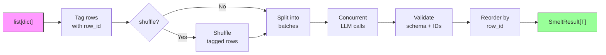
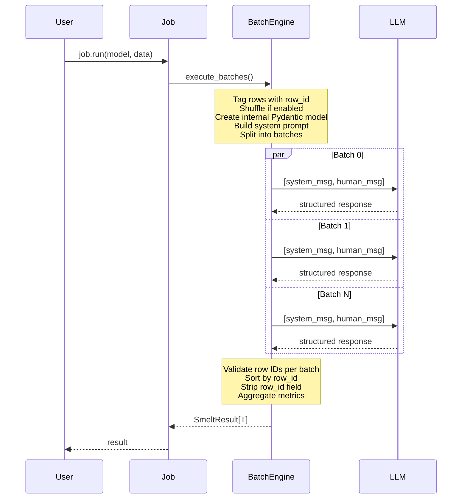
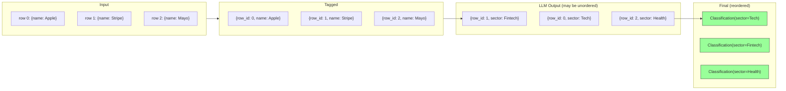
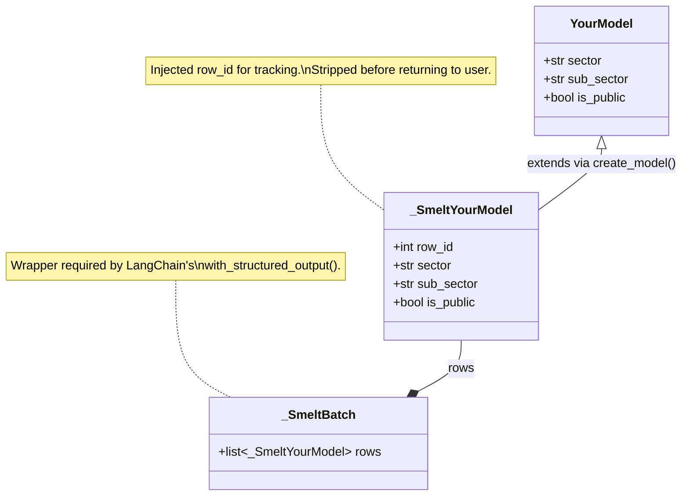

# Architecture

## Pipeline overview

## How a job executes

## Row ID tracking

Smelt injects a `row_id` field into your Pydantic model, instructs the LLM to echo it back, then validates and strips it before returning results. This ensures correct ordering even when batches complete out of order.

## Dynamic model creation

Under the hood, smelt dynamically extends your Pydantic model to add `row_id`, then wraps it in a batch container for LangChain's `with_structured_output`:

This approach:

1. **Preserves all your validators** — the internal model inherits from your model, so all field validators and model validators run
2. **Keeps the public API clean** — `row_id` is never visible in your results
3. **Enables batch processing** — LangChain's `with_structured_output` requires a single model, not a list. The batch wrapper provides this.
