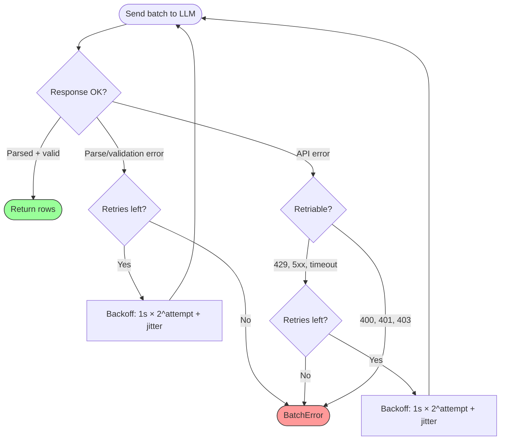

# Batching & Concurrency

## How batching works

Smelt splits your input data into fixed-size batches and sends each batch as a single LLM request. This is more efficient than one-row-at-a-time calls and gives the LLM context about related rows.

```python
job = Job(
    prompt="Classify each company by industry sector",
    output_model=Classification,
    batch_size=10,    # 10 rows per LLM call
    concurrency=3,    # Up to 3 calls at once
)
```

## Concurrency model

Smelt uses `asyncio.Semaphore` for cooperative async concurrency — no threads, no process pools. While one batch awaits an LLM response, others can fire off their requests on the same thread.

```mermaid
gantt
    title concurrency=3, batch_size=5, 15 rows
    dateFormat X
    axisFormat %s

    section Batch 0
    LLM call (rows 0-4)   :active, b0, 0, 3

    section Batch 1
    LLM call (rows 5-9)   :active, b1, 0, 4

    section Batch 2
    LLM call (rows 10-14) :active, b2, 0, 2

    section Semaphore
    3 slots occupied       :crit, s0, 0, 2
    2 slots occupied       :s1, 2, 3
    1 slot occupied        :s2, 3, 4
```



## Tuning batch_size

| Batch size | Trade-off |
|---|---|
| **Small (1–5)** | More LLM calls, higher overhead, but each call is simpler. Good for complex schemas. |
| **Medium (10–20)** | Good balance for most workloads. |
| **Large (50+)** | Fewer calls, but risk hitting token limits. LLM may struggle with many rows. |

!!! tip
    Start with `batch_size=10` and adjust based on your schema complexity and token usage in `result.metrics`.

## Tuning concurrency

| Concurrency | Trade-off |
|---|---|
| **1** | Serial execution. Safest for rate-limited APIs. |
| **3** | Good default. Balances throughput with rate limit headroom. |
| **10+** | High throughput, but may trigger rate limits (429 errors). Smelt retries these automatically. |

## Shuffle

Shuffling randomizes row order before batching. This can help when:

- Input data has clusters of similar rows (e.g. sorted by category)
- You want to distribute "hard" rows across batches to avoid one batch failing disprally

```python
job = Job(
    prompt="...",
    output_model=MyModel,
    shuffle=True,  # Randomize before batching
)
```

!!! note
    Shuffling only affects how rows are grouped into batches. The final `result.data` is **always** returned in original input order.

## Retry & backoff

Each batch independently retries on failure with exponential backoff:



**Retriable errors:**

- Validation/parse errors (bad schema from LLM)
- HTTP 429 (rate limit)
- HTTP 5xx (server errors)
- Timeouts and connection errors

**Non-retriable errors (fail immediately):**

- HTTP 400 (bad request)
- HTTP 401 (unauthorized)
- HTTP 403 (forbidden)

Backoff formula: `1s × 2^attempt + random jitter`, capped at 60 seconds.

## Metrics

After a run, inspect `result.metrics` for tuning:

```python
result = job.run(model, data=data)
m = result.metrics

print(f"Rows: {m.successful_rows}/{m.total_rows}")
print(f"Batches: {m.successful_batches}/{m.total_batches}")
print(f"Retries: {m.total_retries}")
print(f"Tokens: {m.input_tokens:,} in / {m.output_tokens:,} out")
print(f"Time: {m.wall_time_seconds:.2f}s")
```
