# Batching & Concurrency

## How batching works

Smelt splits your input data into fixed-size batches and sends each batch as a single LLM request. Each batch is an independent LLM call containing multiple rows of data.

```python
# 100 rows, batch_size=20 → 5 LLM calls
# 100 rows, batch_size=10 → 10 LLM calls
# 100 rows, batch_size=1  → 100 LLM calls
```

**Why batch?** Sending multiple rows per call:

- **Reduces overhead** — fewer API calls, less network latency
- **Shares context** — the LLM can use cross-row context for better results
- **Lowers cost** — the system prompt (which is identical across calls) is sent fewer times

```python
job = Job(
    prompt="Classify each company by industry sector",
    output_model=Classification,
    batch_size=10,    # 10 rows per LLM call
    concurrency=3,    # Up to 3 calls at once
)
```

## Concurrency model

Smelt uses `asyncio.Semaphore` for cooperative async concurrency — no threads, no process pools. While one batch awaits an LLM response, others can fire off their requests on the same thread.

```mermaid
gantt
    title concurrency=3, batch_size=5, 15 rows
    dateFormat X
    axisFormat %s

    section Batch 0
    LLM call (rows 0-4)   :active, b0, 0, 3

    section Batch 1
    LLM call (rows 5-9)   :active, b1, 0, 4

    section Batch 2
    LLM call (rows 10-14) :active, b2, 0, 2

    section Semaphore
    3 slots occupied       :crit, s0, 0, 2
    2 slots occupied       :s1, 2, 3
    1 slot occupied        :s2, 3, 4
```



With `concurrency=3`:

- Batches 0, 1, and 2 start immediately (3 semaphore slots)
- When batch 2 finishes, its slot is freed — but there are no more batches in this example
- With more batches, batch 3 would start as soon as any of the first 3 finishes

## Tuning batch_size

| Batch size | Pros | Cons | Best for |
|---|---|---|---|
| **1** | Simplest for the LLM, lowest per-call token count | Highest overhead, most API calls | Very complex schemas, debugging |
| **5** | Good for complex schemas | More calls than needed for simple tasks | Complex output with many fields |
| **10** (default) | Good balance | — | Most workloads |
| **20–30** | Fewer API calls, better cross-row context | Longer responses, higher per-call cost | Simple schemas, large datasets |
| **50+** | Fewest calls | Risk hitting token limits, LLM may lose track of rows | Only simple schemas with short rows |

!!! tip "How to choose"
    Start with `batch_size=10`. Then check `result.metrics`:

    - If `output_tokens` per batch is very high → decrease batch_size
    - If `wall_time_seconds` is dominated by many small calls → increase batch_size
    - If you see validation errors (wrong row count) → decrease batch_size

!!! warning "Token limits"
    Each batch is a single LLM call. The input tokens include the system prompt + all rows in the batch. The output includes structured JSON for all rows. Very large batches may exceed the model's context window or output token limit, causing failures.

### Example: Finding the right batch_size

```python
# Start with default
job = Job(prompt="...", output_model=MyModel, batch_size=10)
result = job.run(model, data=data)

print(f"Batches: {result.metrics.total_batches}")
print(f"Tokens per batch: ~{result.metrics.input_tokens // result.metrics.total_batches} in, "
      f"~{result.metrics.output_tokens // result.metrics.total_batches} out")
print(f"Retries: {result.metrics.total_retries}")
print(f"Time: {result.metrics.wall_time_seconds:.2f}s")

# If tokens per batch are low and retries are 0, try increasing:
job = Job(prompt="...", output_model=MyModel, batch_size=25)
# If retries are high, try decreasing:
job = Job(prompt="...", output_model=MyModel, batch_size=5)
```

## Tuning concurrency

| Concurrency | Behavior | Best for |
|---|---|---|
| **1** | Serial — one batch at a time | Rate-limited APIs, debugging, reproducibility |
| **3** (default) | Moderate parallelism | Most workloads |
| **5–10** | High throughput | Large datasets, high-tier API plans |
| **10+** | Maximum throughput | Only if your API plan supports it |

!!! warning "Rate limits"
    Higher concurrency means more simultaneous API requests. If your API plan has low rate limits, you may trigger 429 (Too Many Requests) errors. Smelt retries these automatically with exponential backoff, but it's more efficient to set concurrency within your rate limit.

### Concurrency vs batch_size interaction

The total throughput is:

```
rows/second ≈ concurrency × batch_size / avg_response_time
```

Example configurations for 1000 rows:

| Config | Batches | Concurrent | Behavior |
|---|---|---|---|
| `batch_size=10, concurrency=1` | 100 | 1 at a time | Safe but slow |
| `batch_size=10, concurrency=5` | 100 | 5 at a time | Good balance |
| `batch_size=50, concurrency=3` | 20 | 3 at a time | Fewer, larger calls |
| `batch_size=1, concurrency=20` | 1000 | 20 at a time | Fast but heavy on API |

## Shuffle

Shuffling randomizes row order before splitting into batches. The final `result.data` is **always** returned in original input order regardless of shuffle.

```python
job = Job(
    prompt="...",
    output_model=MyModel,
    shuffle=True,
)
```

### When to use shuffle

**Use shuffle when your data has clusters of similar rows:**

```python
# Without shuffle — batch 0 gets all tech companies, batch 1 gets all banks
data = [
    {"name": "Apple", "type": "tech"},      # batch 0
    {"name": "Google", "type": "tech"},     # batch 0
    {"name": "Meta", "type": "tech"},       # batch 0
    {"name": "JPMorgan", "type": "bank"},   # batch 1
    {"name": "Goldman", "type": "bank"},    # batch 1
    {"name": "Citi", "type": "bank"},       # batch 1
]

# With shuffle — rows are mixed across batches
# This gives the LLM more diverse context per batch
```

**Use shuffle to distribute "hard" rows:**

If some rows consistently cause validation failures, shuffling distributes them across batches so one batch doesn't accumulate all the difficult cases.

**Don't use shuffle when:**

- Order doesn't matter (most cases)
- You want deterministic batching for debugging
- Row context within a batch matters (e.g. time-series data)

### How shuffle works internally

1. Tagged rows are copied (original list is never modified)
2. The copy is shuffled using `random.shuffle()`
3. Shuffled rows are split into batches
4. After processing, all rows are sorted by `row_id` before returning
5. `result.data` is in the exact same order as your input `data`

## Retry & backoff

Each batch independently retries on failure with exponential backoff:


### Retriable errors

These errors trigger retries (up to `max_retries`):

| Error type | Examples |
|---|---|
| **Validation errors** | Wrong row count, missing/duplicate row IDs, schema mismatch |
| **Parse errors** | LLM returned malformed JSON |
| **HTTP 429** | Rate limit exceeded |
| **HTTP 5xx** | Server error (500, 502, 503, 504) |
| **Timeouts** | Request timed out |
| **Connection errors** | Network failure |

### Non-retriable errors

These errors fail the batch immediately without retrying:

| Error type | Examples |
|---|---|
| **HTTP 400** | Bad request (malformed input) |
| **HTTP 401** | Unauthorized (invalid API key) |
| **HTTP 403** | Forbidden (insufficient permissions) |

### Backoff formula

```
delay = min(1s × 2^attempt + random_jitter, 60s)
```

| Attempt | Base delay | With jitter (approx) |
|---|---|---|
| 0 (first retry) | 1s | 1.0–1.1s |
| 1 | 2s | 2.0–2.2s |
| 2 | 4s | 4.0–4.4s |
| 3 | 8s | 8.0–8.8s |
| 4 | 16s | 16.0–17.6s |
| 5+ | 32–60s | Capped at 60s |

### Tuning max_retries

```python
# Strict — fail fast (good for debugging)
job = Job(prompt="...", output_model=MyModel, max_retries=0)

# Default — 3 retries (handles most transient failures)
job = Job(prompt="...", output_model=MyModel, max_retries=3)

# Lenient — 5 retries (for unreliable networks or aggressive rate limits)
job = Job(prompt="...", output_model=MyModel, max_retries=5)
```

!!! info "Total attempts"
    `max_retries=3` means 4 total attempts (1 initial + 3 retries). The maximum wait time for a single batch with `max_retries=3` is about 7 seconds of backoff.

## Metrics

After a run, inspect `result.metrics` for tuning insights:

```python
result = job.run(model, data=data)
m = result.metrics

print(f"Rows: {m.successful_rows}/{m.total_rows}")
print(f"Batches: {m.successful_batches}/{m.total_batches}")
print(f"Retries: {m.total_retries}")
print(f"Tokens: {m.input_tokens:,} in / {m.output_tokens:,} out")
print(f"Time: {m.wall_time_seconds:.2f}s")

# Derived metrics
if m.total_batches > 0:
    print(f"Avg tokens/batch: {m.input_tokens // m.total_batches} in, "
          f"{m.output_tokens // m.total_batches} out")
if m.wall_time_seconds > 0:
    print(f"Throughput: {m.successful_rows / m.wall_time_seconds:.1f} rows/sec")
```

### What to look for

| Metric | Red flag | Action |
|---|---|---|
| `total_retries > 0` | Some batches needed retries | Check if validation errors → simplify schema or reduce batch_size |
| `failed_batches > 0` | Some batches failed entirely | Check `result.errors` for details |
| `wall_time_seconds` high | Slow throughput | Increase concurrency or batch_size |
| High `input_tokens` | Expensive system prompt sent many times | Increase batch_size to reduce batch count |
