```mermaid
flowchart TD
    subgraph "stop_on_exhaustion = True (default)"
        A1[Batch fails] --> A2[Set cancel event]
        A2 --> A3[Pending batches skip]
        A3 --> A4[Raise SmeltExhaustionError]
        A4 --> A5["e.partial_result has\nsuccessful batches"]
    end

    subgraph "stop_on_exhaustion = False"
        B1[Batch fails] --> B2[Record BatchError]
        B2 --> B3[Continue processing]
        B3 --> B4[Return SmeltResult]
        B4 --> B5["result.errors has failures\nresult.data has successes"]
    end

    style A4 fill:#f99,stroke:#333
    style B4 fill:#ff9,stroke:#333
```

# Error Handling

## Exception hierarchy

All smelt exceptions inherit from `SmeltError`, so you can catch everything with a single clause:

```python
from smelt.errors import SmeltError

try:
    result = job.run(model, data=data)
except SmeltError as e:
    print(f"Smelt error: {e}")
```

| Exception | When |
|---|---|
| `SmeltConfigError` | Invalid configuration (bad provider, empty prompt, invalid batch_size) |
| `SmeltValidationError` | LLM output fails Pydantic schema validation |
| `SmeltAPIError` | Non-retriable API error (401, 403) |
| `SmeltExhaustionError` | Batch exhausted all retries (`stop_on_exhaustion=True`) |

## Error handling modes

Smelt provides two strategies for handling batch failures:



### Stop on exhaustion (default)

When any batch fails after all retries, smelt raises `SmeltExhaustionError` immediately. Pending batches are cancelled (in-flight batches finish). The exception carries a `partial_result` with any rows that succeeded before the failure.

```python
from smelt.errors import SmeltExhaustionError

job = Job(
    prompt="...",
    output_model=MyModel,
    stop_on_exhaustion=True,  # default
)

try:
    result = job.run(model, data=data)
except SmeltExhaustionError as e:
    print(f"Failed: {e}")
    print(f"Partial results: {len(e.partial_result.data)} rows")
    print(f"Errors: {len(e.partial_result.errors)} batches")

    # You can still use the partial results
    for row in e.partial_result.data:
        print(row)
```

### Collect errors

Set `stop_on_exhaustion=False` to process all batches regardless of failures. Failed batches are recorded in `result.errors`, and successful rows are in `result.data`.

```python
job = Job(
    prompt="...",
    output_model=MyModel,
    stop_on_exhaustion=False,
)

result = job.run(model, data=data)

if result.success:
    print("All batches succeeded")
else:
    print(f"Succeeded: {len(result.data)} rows")
    print(f"Failed: {len(result.errors)} batches")
    for err in result.errors:
        print(f"  Batch {err.batch_index}: {err.error_type} — {err.message}")
```

## BatchError details

Each failed batch produces a `BatchError` with diagnostic information:

```python
for err in result.errors:
    print(f"Batch index:  {err.batch_index}")
    print(f"Row IDs:      {err.row_ids}")
    print(f"Error type:   {err.error_type}")
    print(f"Message:      {err.message}")
    print(f"Attempts:     {err.attempts}")
    print(f"Raw response: {err.raw_response}")
```

## Configuration errors

`SmeltConfigError` is raised immediately during job creation or model initialization — before any LLM calls are made:

```python
from smelt.errors import SmeltConfigError

try:
    job = Job(prompt="", output_model=MyModel)  # Empty prompt
except SmeltConfigError as e:
    print(f"Config error: {e}")

try:
    model = Model(provider="nonexistent", name="fake")
    model.get_chat_model()
except SmeltConfigError as e:
    print(f"Provider error: {e}")
```
