# Error Handling

## Exception hierarchy

All smelt exceptions inherit from `SmeltError`, so you can catch everything with a single clause:

```python
from smelt.errors import SmeltError

try:
    result = job.run(model, data=data)
except SmeltError as e:
    print(f"Smelt error: {e}")
```

The full hierarchy:

```
SmeltError (base)
├── SmeltConfigError       # Invalid configuration
├── SmeltValidationError   # LLM output fails schema validation
├── SmeltAPIError          # Non-retriable API error
└── SmeltExhaustionError   # Batch exhausted all retries
```

| Exception | When raised | Contains |
|---|---|---|
| `SmeltConfigError` | Job creation or model init | Error message |
| `SmeltValidationError` | LLM output fails validation (internal, triggers retry) | `raw_response` |
| `SmeltAPIError` | Non-retriable API error (internal, triggers immediate failure) | `status_code` |
| `SmeltExhaustionError` | Batch exhausted retries with `stop_on_exhaustion=True` | `partial_result: SmeltResult` |

!!! info "Internal vs user-facing exceptions"
    `SmeltValidationError` and `SmeltAPIError` are raised **internally** during batch processing. You won't see them directly unless you're catching `SmeltError` broadly — they're caught by the batch engine's retry loop. `SmeltExhaustionError` is the user-facing exception for failed batches.

## Error handling modes

Smelt provides two strategies for handling batch failures, controlled by the `stop_on_exhaustion` parameter:

```mermaid
flowchart TD
    subgraph "stop_on_exhaustion = True (default)"
        A1[Batch fails] --> A2[Set cancel event]
        A2 --> A3[Pending batches skip]
        A3 --> A4[Raise SmeltExhaustionError]
        A4 --> A5["e.partial_result has\nsuccessful batches"]
    end

    subgraph "stop_on_exhaustion = False"
        B1[Batch fails] --> B2[Record BatchError]
        B2 --> B3[Continue processing]
        B3 --> B4[Return SmeltResult]
        B4 --> B5["result.errors has failures\nresult.data has successes"]
    end

    style A4 fill:#f99,stroke:#333
    style B4 fill:#ff9,stroke:#333
```



### stop_on_exhaustion=True (default)

When any batch fails after all retries, smelt:

1. Sets a **cancel event** — signals all other pending batches to skip
2. **Waits for in-flight batches** to finish (doesn't kill them mid-request)
3. **Raises `SmeltExhaustionError`** with a `partial_result` containing any rows that succeeded

```python
from smelt.errors import SmeltExhaustionError

job = Job(
    prompt="Classify each company by industry sector",
    output_model=Classification,
    stop_on_exhaustion=True,  # default
)

try:
    result = job.run(model, data=companies)
    # All batches succeeded
    print(f"All {len(result.data)} rows processed")
except SmeltExhaustionError as e:
    # At least one batch failed
    print(f"Error: {e}")
    print(f"Partial results: {len(e.partial_result.data)} rows succeeded")
    print(f"Failed batches: {len(e.partial_result.errors)}")

    # You can still use the partial results
    for row in e.partial_result.data:
        process(row)

    # Inspect what went wrong
    for err in e.partial_result.errors:
        print(f"  Batch {err.batch_index}: {err.error_type} — {err.message}")
```

**When to use:** When partial results are not acceptable and you want to fail fast. Good for pipelines where downstream processing requires all rows.

### stop_on_exhaustion=False

All batches run to completion regardless of failures. Failed batches are recorded in `result.errors`, successful rows in `result.data`.

```python
job = Job(
    prompt="Classify each company by industry sector",
    output_model=Classification,
    stop_on_exhaustion=False,
)

result = job.run(model, data=companies)

if result.success:
    print(f"All {len(result.data)} rows succeeded")
else:
    print(f"Succeeded: {len(result.data)} rows")
    print(f"Failed: {len(result.errors)} batches ({result.metrics.failed_rows} rows)")

    for err in result.errors:
        print(f"  Batch {err.batch_index}: {err.error_type} — {err.message}")
        print(f"    Row IDs: {err.row_ids}")
        print(f"    Attempts: {err.attempts}")
```

**When to use:** When you want to get as many results as possible, even if some fail. Good for exploratory analysis or when you can process partial results.

## BatchError details

Each failed batch produces a `BatchError` with full diagnostic information:

```python
@dataclass(frozen=True)
class BatchError:
    batch_index: int          # Which batch failed (0-indexed)
    row_ids: tuple[int, ...]  # Row IDs that were in this batch
    error_type: str           # "validation", "api", or "cancelled"
    message: str              # Human-readable error description
    attempts: int             # Total attempts made (including initial)
    raw_response: str | None  # Raw LLM response, if available
```

### Error types

| `error_type` | Meaning | Common causes |
|---|---|---|
| `"validation"` | LLM output failed schema/row ID validation | Wrong row count, missing IDs, bad JSON structure |
| `"api"` | API error (retriable exhausted or non-retriable) | Rate limits, server errors, auth failures |
| `"cancelled"` | Batch was cancelled due to `stop_on_exhaustion` | Another batch failed first |

### Inspecting errors

```python
for err in result.errors:
    print(f"Batch {err.batch_index}:")
    print(f"  Type:     {err.error_type}")
    print(f"  Message:  {err.message}")
    print(f"  Row IDs:  {err.row_ids}")
    print(f"  Attempts: {err.attempts}")
    if err.raw_response:
        print(f"  Raw:      {err.raw_response[:200]}...")
```

### Identifying which rows failed

```python
# Get the row IDs that failed
failed_row_ids = set()
for err in result.errors:
    failed_row_ids.update(err.row_ids)

# Retry just the failed rows
failed_data = [data[i] for i in sorted(failed_row_ids)]
retry_result = job.run(model, data=failed_data)
```

## Configuration errors

`SmeltConfigError` is raised immediately during job creation or model initialization — before any LLM calls are made. This means you catch configuration problems early.

```python
from smelt import Job, Model
from smelt.errors import SmeltConfigError

# Empty prompt
try:
    job = Job(prompt="", output_model=MyModel)
except SmeltConfigError as e:
    print(e)  # "Job prompt must be a non-empty string."

# Invalid batch_size
try:
    job = Job(prompt="classify", output_model=MyModel, batch_size=0)
except SmeltConfigError as e:
    print(e)  # "batch_size must be >= 1, got 0."

# Invalid concurrency
try:
    job = Job(prompt="classify", output_model=MyModel, concurrency=-1)
except SmeltConfigError as e:
    print(e)  # "concurrency must be >= 1, got -1."

# Non-BaseModel output_model
try:
    job = Job(prompt="classify", output_model=dict)
except SmeltConfigError as e:
    print(e)  # "output_model must be a Pydantic BaseModel subclass, got <class 'type'>."

# Reserved field name
class BadModel(BaseModel):
    row_id: int  # Conflicts with smelt's internal tracking
    name: str

try:
    job = Job(prompt="classify", output_model=BadModel)
    job.run(model, data=[{"x": 1}])
except SmeltConfigError as e:
    print(e)  # "Output model 'BadModel' already has a 'row_id' field..."

# Bad provider
try:
    model = Model(provider="nonexistent", name="fake-model")
    model.get_chat_model()
except SmeltConfigError as e:
    print(e)  # "Failed to initialize model 'fake-model' with provider 'nonexistent': ..."
```

## Patterns

### Retry failed rows

```python
job = Job(prompt="...", output_model=MyModel, stop_on_exhaustion=False)
result = job.run(model, data=data)

if not result.success:
    # Collect failed row indices
    failed_ids = set()
    for err in result.errors:
        failed_ids.update(err.row_ids)

    # Retry with smaller batch_size
    retry_job = Job(prompt="...", output_model=MyModel, batch_size=1, max_retries=5)
    failed_data = [data[i] for i in sorted(failed_ids)]
    retry_result = retry_job.run(model, data=failed_data)
```

### Graceful degradation

```python
from smelt.errors import SmeltExhaustionError

try:
    result = job.run(model, data=data)
    process_all(result.data)
except SmeltExhaustionError as e:
    # Use what we have, flag the rest
    process_partial(e.partial_result.data)
    flag_for_manual_review(e.partial_result.errors)
```

### Logging errors for monitoring

```python
import logging
logger = logging.getLogger("smelt")

result = job.run(model, data=data)

for err in result.errors:
    logger.error(
        "Batch %d failed: %s (%d attempts, rows %s)",
        err.batch_index,
        err.message,
        err.attempts,
        err.row_ids,
    )

logger.info(
    "Job complete: %d/%d rows, %d retries, %.2fs",
    result.metrics.successful_rows,
    result.metrics.total_rows,
    result.metrics.total_retries,
    result.metrics.wall_time_seconds,
)
```
