# Smelt — Technical Specification

> LLM-powered data transformation library for Python.
> Raw data in, structured typed output out.

---

## Overview

Smelt takes structured data (`list[dict]`), runs it through an LLM with user-defined instructions, and returns strictly validated structured output (`list[PydanticModel]`). It handles batching, concurrency, retries, and validation so the user doesn't have to.

**Current scope:** Transform (1:1 row mapping). Aggregate (many:1) is deferred.

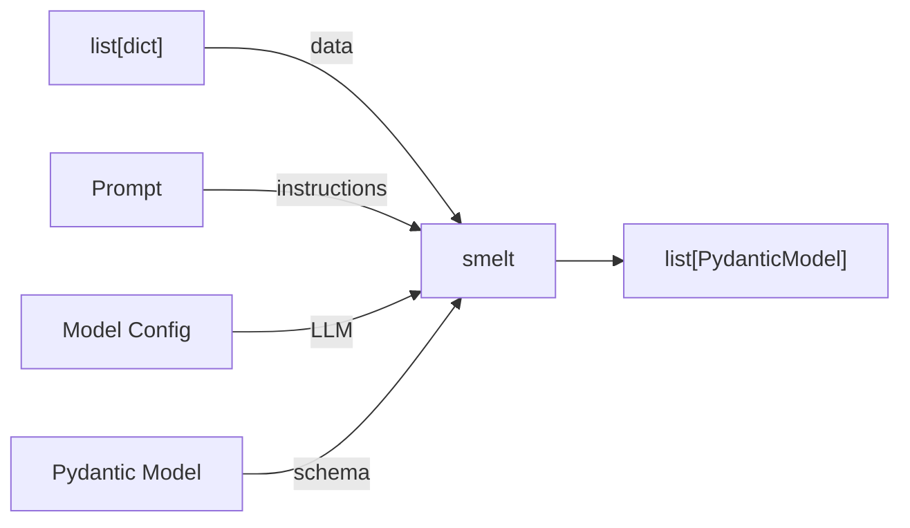

---

## Core Concepts

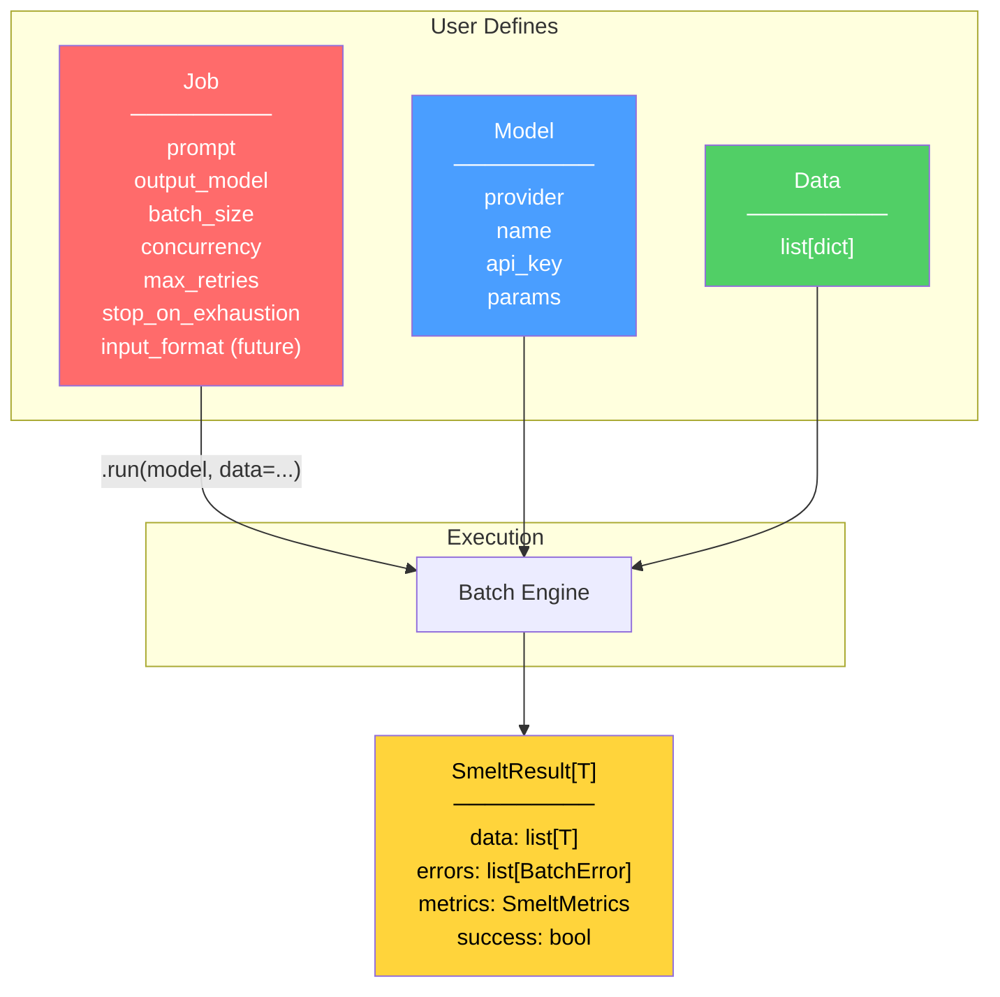

**Model** — LLM provider configuration (Pydantic model). Wraps LangChain's `init_chat_model`. Reusable across jobs. Serializable to JSON.

**Job** — Transformation recipe (Pydantic model). Defines what to do (prompt + output schema) and how (batch config + retry policy). Reusable across datasets. Serializable to JSON for sharing.

**Data** — Provided at execution time. Plain `list[dict]`.

**SmeltResult** — Contains typed output, errors, and metrics.

---

## API Surface

```python
from pydantic import BaseModel
from smelt import Model, Job

# Configure LLM
model = Model(
    provider="openai",
    name="gpt-4o",
    api_key="sk-...",
    params={"temperature": 0, "max_tokens": 4096},
)

# Define transformation
class Classification(BaseModel):
    industry: str
    confidence: float
    reasoning: str

job = Job(
    prompt="Classify each company by industry sector",
    output_model=Classification,
    batch_size=20,
    concurrency=3,
    max_retries=3,
    stop_on_exhaustion=True,
)

# Execute (sync)
result = job.run(model, data=rows)

# Execute (async)
result = await job.arun(model, data=rows)

# Access results
result.data       # list[Classification]
result.errors     # list[BatchError]
result.metrics    # SmeltMetrics
result.success    # bool

# Serialize job config for sharing
job_json = job.model_dump_json(indent=2)
loaded_job = Job.model_validate_json(job_json)
```

---

## Execution Pipeline

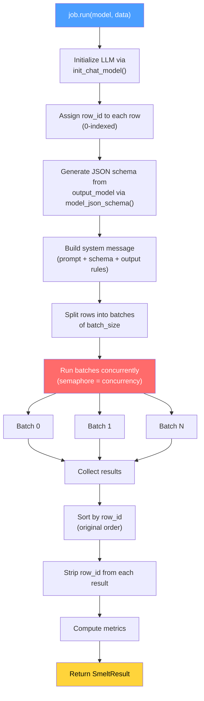

---

## Prompt Construction

The prompt is built by stitching together three layers into a single system message. No `with_structured_output()` — we own the full prompt and parse raw LLM text ourselves.

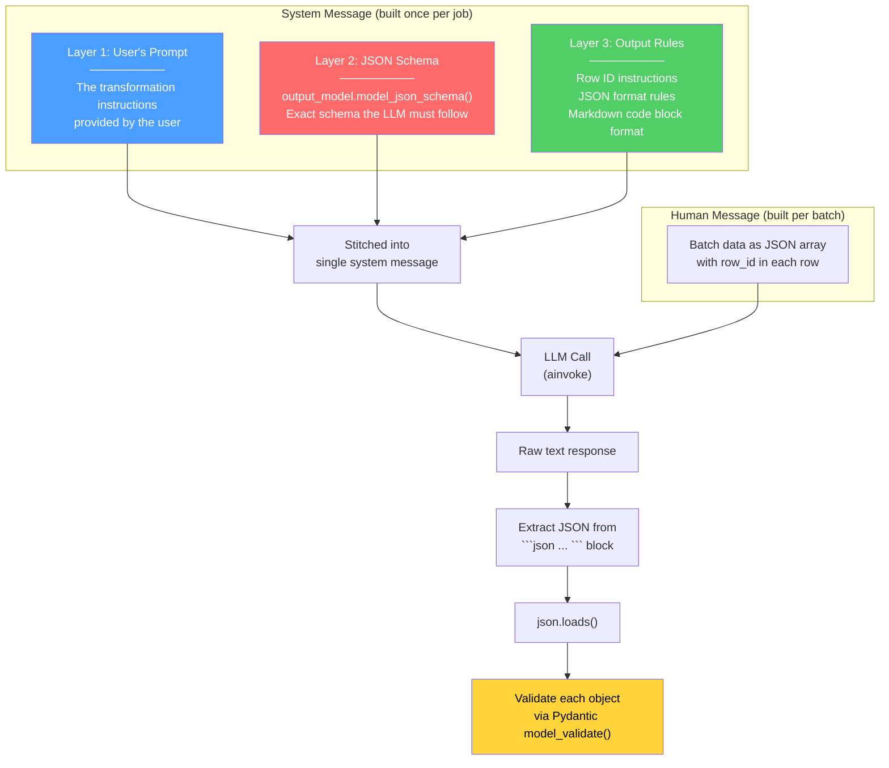

### System Message Template

```
{user's prompt}

## Output Schema

You must output a list of JSON objects. Each object must conform to the following JSON schema:

{output_model.model_json_schema() as formatted JSON}

Additionally, each object MUST include a `row_id` integer field matching the
`row_id` from the corresponding input row.

## Output Rules

- Return EXACTLY one object per input row.
- Each object MUST include the `row_id` from its input row.
- Do NOT skip, duplicate, or invent row_ids.
- Do NOT reorder — maintain original row_id ordering.
- Return ALL rows in a single response.

Your output must be a JSON array wrapped in a markdown code block:

```json
[
  {"row_id": 0, ...},
  {"row_id": 1, ...}
]
```
```

### Human Message Template (per batch)

Input data is serialized as a raw JSON array (default). Each row includes its assigned `row_id`.

```
Transform the following rows:

[
  {"row_id": 0, "name": "Acme Corp", "description": "Makes rockets"},
  {"row_id": 1, "name": "BioGen", "description": "Gene therapy startup"}
]
```

> **Future:** `input_format` Job config option to control how batch data is serialized
> (e.g., `"json"` (default), `"markdown_table"`, `"csv"`). For v0.1, JSON only.

### Response Parsing Pipeline

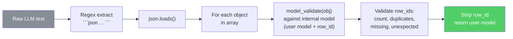

The parsing extracts JSON from the first `` ```json ... ``` `` block in the response, runs `json.loads()` on it, then validates each object against the internal Pydantic model (user's model + `row_id` field). If any step fails, it triggers a retry.

---

## Batch Processing (Per Batch)

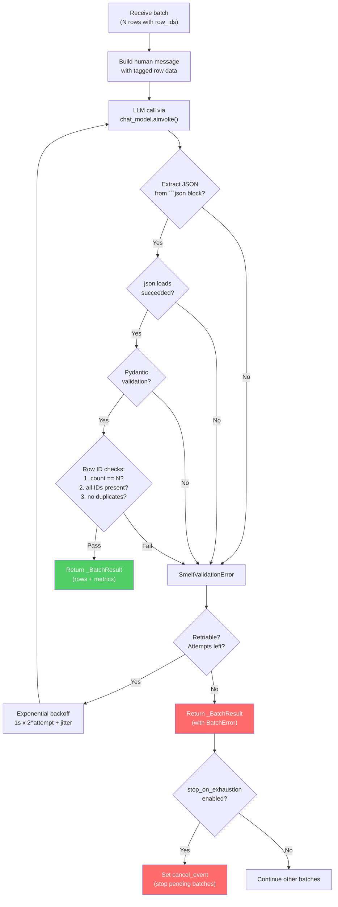

---

## Row ID System

Each input row is assigned a unique `row_id` (0-indexed integer) before batching. This ID flows through the entire pipeline for integrity checking and order preservation.

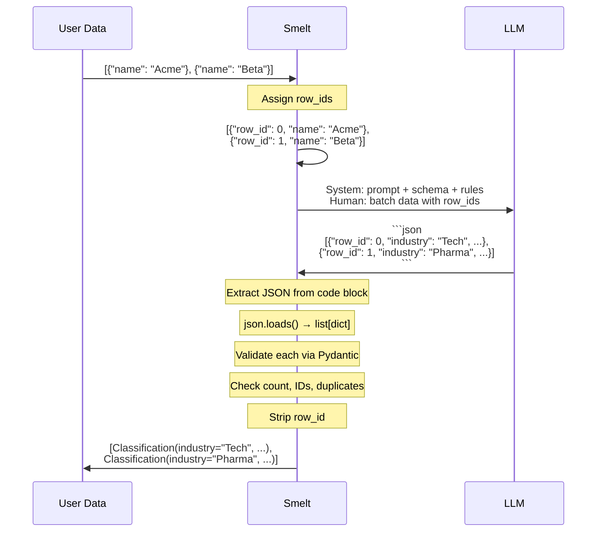

**Validation checks after each LLM call:**

| Check | Failure Triggers |
|-------|-----------------|
| JSON code block found in response | Retry |
| `json.loads()` succeeds | Retry |
| Each object passes `model_validate()` | Retry |
| Response list length == batch size | Retry |
| All expected `row_id` values present | Retry |
| No duplicate `row_id` values | Retry |
| No unexpected `row_id` values | Retry |

---

## Dynamic Model Creation

User's Pydantic model is extended at runtime with a `row_id` field for internal tracking. The JSON schema is generated via `model_json_schema()` and stitched into the prompt.

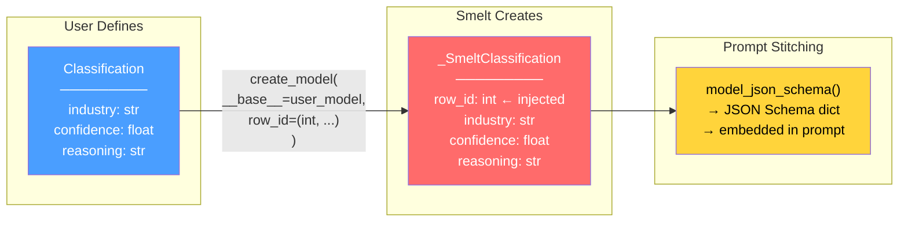

- Uses `pydantic.create_model` with `__base__` — inherits all validators and config from user's model
- `model_json_schema()` on the internal model produces the schema embedded in the prompt
- LLM response is parsed from raw text (no `with_structured_output`)
- Each response object is validated via `model_validate()` against the internal model
- `row_id` is stripped via `model_dump(exclude={"row_id"})` before returning to user
- Errors if user's model already has a `row_id` field (reserved)

---

## Serializable Configs

Both `Model` and `Job` are Pydantic `BaseModel` subclasses, making them natively serializable to JSON. This allows users to save, share, and version their configs.

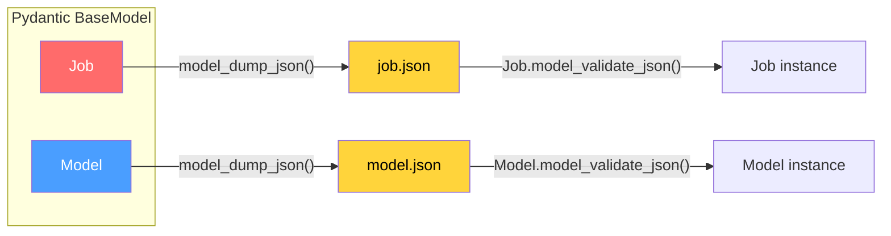

```python
# Save job config
with open("classify_job.json", "w") as f:
    f.write(job.model_dump_json(indent=2))

# Load and reuse
with open("classify_job.json") as f:
    loaded_job = Job.model_validate_json(f.read())
result = loaded_job.run(model, data=new_data)
```

**Note:** `output_model` in Job is stored as the fully qualified class name (e.g., `"myapp.models.Classification"`) when serialized, and resolved via import when deserialized.

---

## Retry and Error Handling

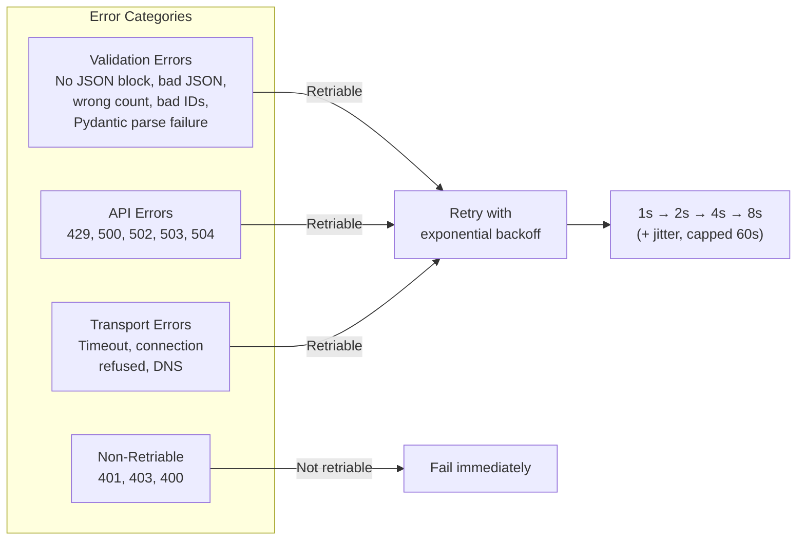

### Retry Timeline (max_retries=3)

```mermaid
gantt
    title Batch Retry Timeline
    dateFormat X
    axisFormat %s

    section Attempts
    Attempt 0 (first try)     :a0, 0, 1
    Backoff ~1s               :crit, b0, 1, 2
    Attempt 1 (retry 1)       :a1, 2, 3
    Backoff ~2s               :crit, b1, 3, 5
    Attempt 2 (retry 2)       :a2, 5, 6
    Backoff ~4s               :crit, b2, 6, 10
    Attempt 3 (retry 3)       :a3, 10, 11
    Exhausted → BatchError    :done, e, 11, 12
```

### Exhaustion Behavior

| `stop_on_exhaustion` | Behavior |
|---------------------|----------|
| `True` (default) | Cancel pending batches. Raise `SmeltExhaustionError` with `partial_result` attached so caller can recover successful rows. |
| `False` | Mark batch as failed. Continue other batches. Return `SmeltResult` with `errors` populated. |

```python
# Handling exhaustion (stop_on_exhaustion=True)
try:
    result = job.run(model, data=rows)
except SmeltExhaustionError as e:
    print(f"Failed: {e}")
    partial = e.partial_result
    print(f"Recovered {len(partial.data)} of {partial.metrics.total_rows} rows")

# Handling partial failure (stop_on_exhaustion=False)
result = job.run(model, data=rows)
if not result.success:
    for err in result.errors:
        print(f"Batch {err.batch_index} failed: {err.message}")
        print(f"  Lost row_ids: {err.row_ids}")
```

---

## Concurrency Model

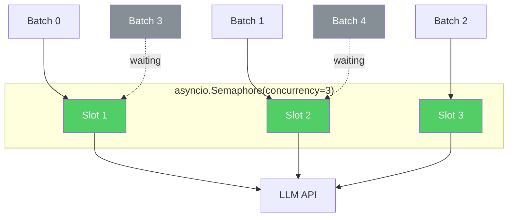

- All batches launched as `asyncio.Task` immediately
- Semaphore limits active LLM calls to `concurrency`
- Pending batches check `cancel_event` before acquiring semaphore
- In-flight batches are allowed to finish (cooperative cancellation)

---

## Package Architecture

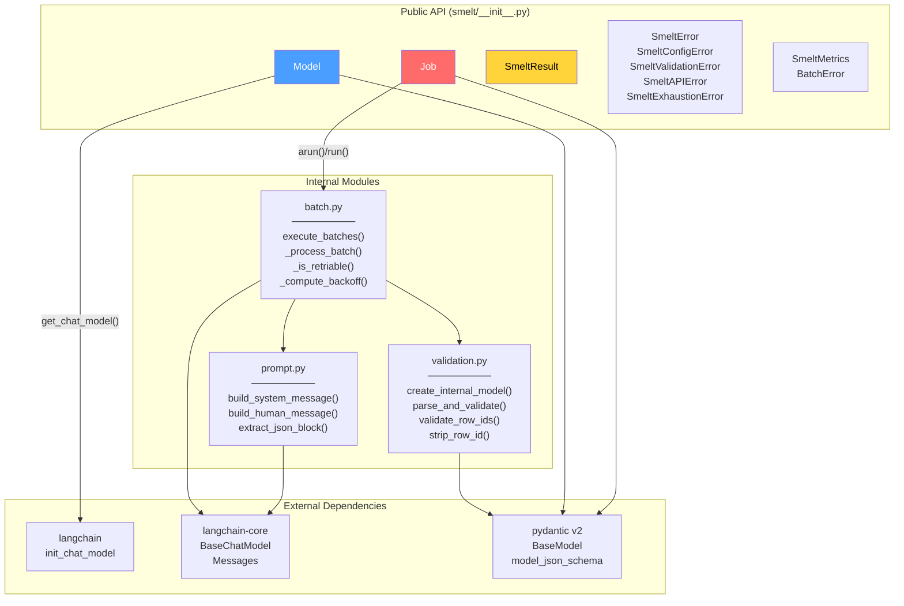

---

## Dependency Stack

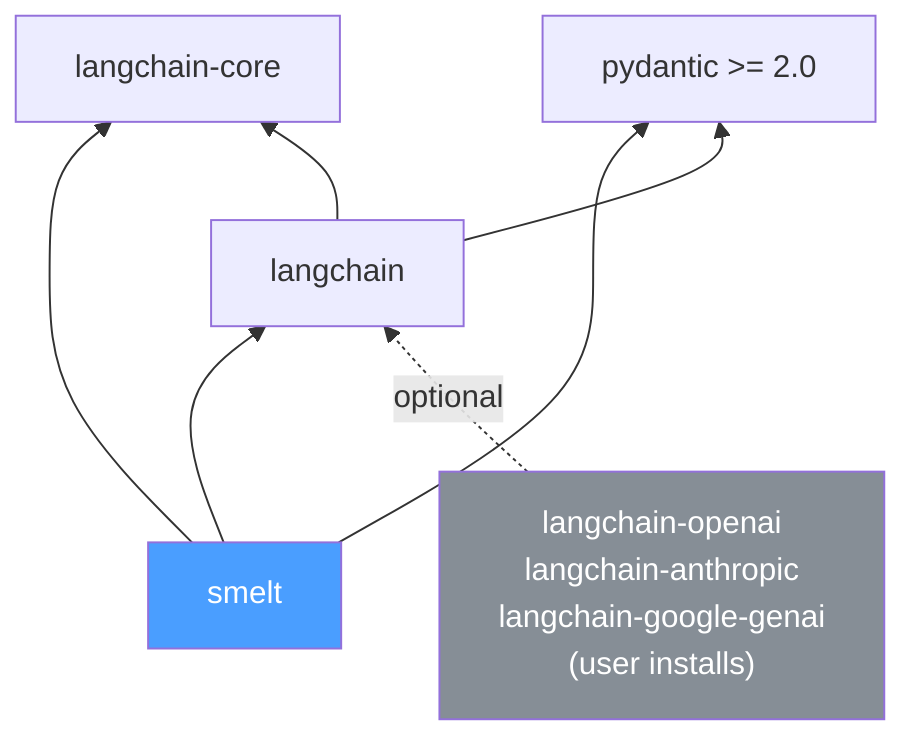

```
pip install smelt                      # core, no providers
pip install smelt[openai]              # + langchain-openai
pip install smelt[anthropic]           # + langchain-anthropic
pip install "smelt[openai,anthropic]"  # multiple
```

---

## Result Object

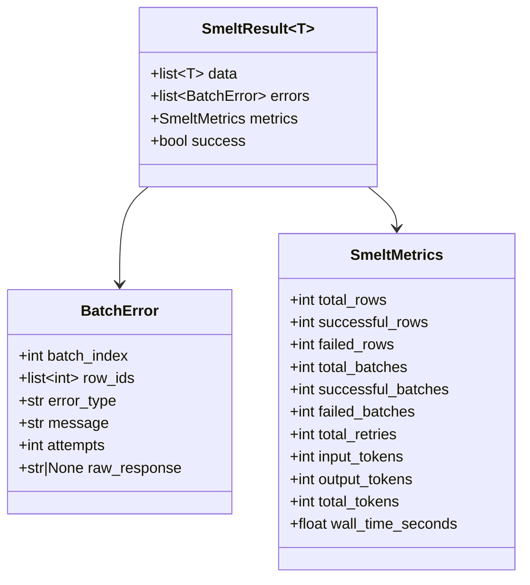

---

## Exception Hierarchy

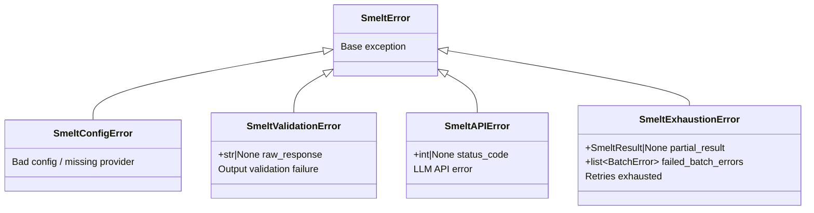

---

## File Manifest

| File | Purpose | Key Contents |
|------|---------|-------------|
| `pyproject.toml` | Package config | hatchling build, deps, Python >=3.10 |
| `src/smelt/__init__.py` | Public API | Exports Model, Job, SmeltResult, errors |
| `src/smelt/types.py` | Data containers | SmeltResult[T], SmeltMetrics, BatchError, internal types |
| `src/smelt/errors.py` | Exceptions | SmeltError hierarchy (5 classes) |
| `src/smelt/model.py` | LLM config | Model (Pydantic), lazy init_chat_model |
| `src/smelt/job.py` | Entry point | Job (Pydantic), run() / arun() |
| `src/smelt/batch.py` | Core engine | execute_batches(), retry loop, semaphore concurrency |
| `src/smelt/prompt.py` | Prompt building | System/human messages, JSON extraction, schema stitching |
| `src/smelt/validation.py` | Output validation | Dynamic model creation, row_id checks, Pydantic validation |

---

## Implementation Order

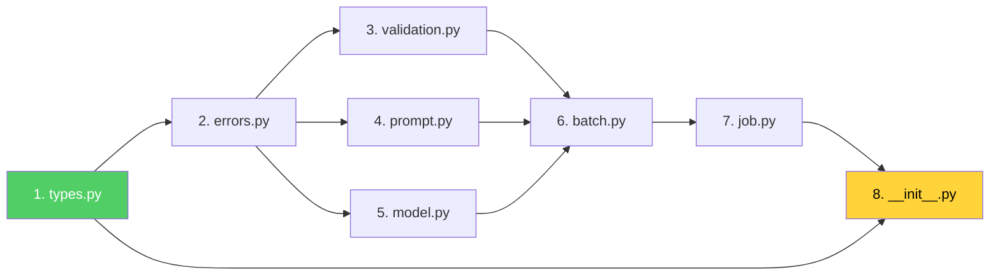

Each module only depends on modules to its left. Zero circular dependencies.
